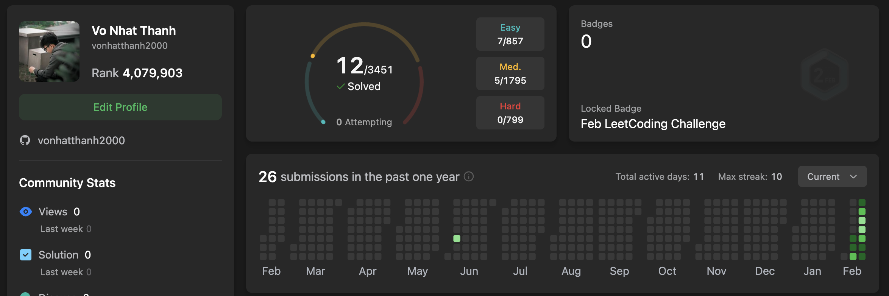

## Recap for Week 1 - ARRAY Chapter

## Array Chapter

### Go

map: is a collection with key/value pair
-> create new map: `make(map[int]int)`
new map with length
`make(map[int]bool, len)`

### Typescript

create new Object:
`const obj:Record<number,number>={}`

create Set
`const numSet = new Set<number>()`

### Check if a element is exist in array

Go: `if idx, exist := arrMap[key]; exist{
something
}

Ts: `if (key in obj)`

#### check if a element is in set or not

ts: `set.has(num)`
